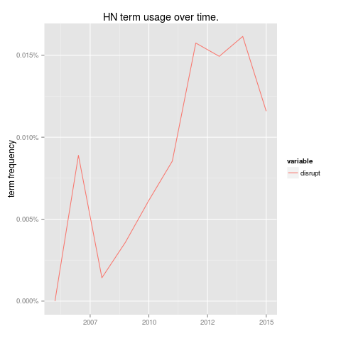
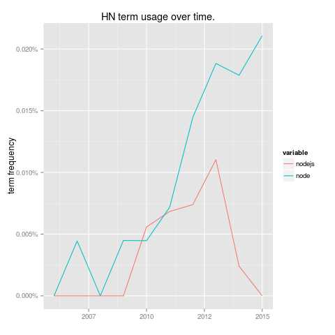
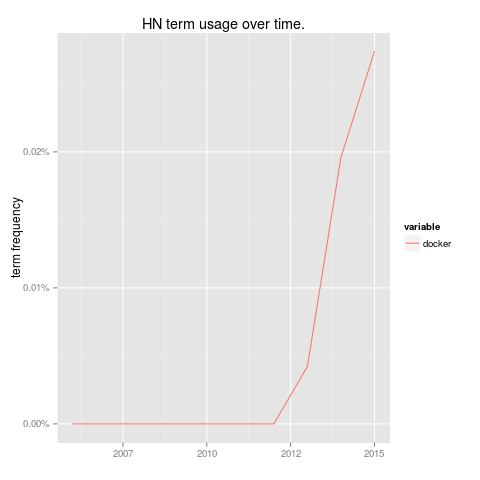

# Hacker-Terms

Hacker terms is a basic term-usage analyser for data from [hacker-news archiver](https://hn-archive.appspot.com/). You can
retrieve this data using the following link*:

magnet:?xt=urn:btih:44c65b5779d9d8021e002584fa73740f36d052a6&dn=10m_hn_comments_sorted.

## Usage

This project consists of analysis and plotting scripts:

- bin/hacker-terms.js takes HN archive dataset from `stdin`, and outputs the usage of given terms over time.

- src/R/plot-term-usage.R takes term usage over time from `stdin`, and outputs a PNG lineplot of term usage over time.

These need to piped together as shown below to produce an output graph.

```bash
< data/10m_hn_comments_sorted.json node bin/hacker-terms.js freq --year -- nodejs | Rscript src/R/plot-term-usage.R - > images/nodejs.png
```

## Example Output







## Weaknesses

- Terms with similar meanings ( node, node.js, nodejs for example) cannot be grouped under a common name.

- R doesn't seem to allow plots to be written to `stdout` directly, so as a hack images are written to a temporary file before being printed to `stdout`.

\* for some reason github doesn't properly support markdown for magnet links.
